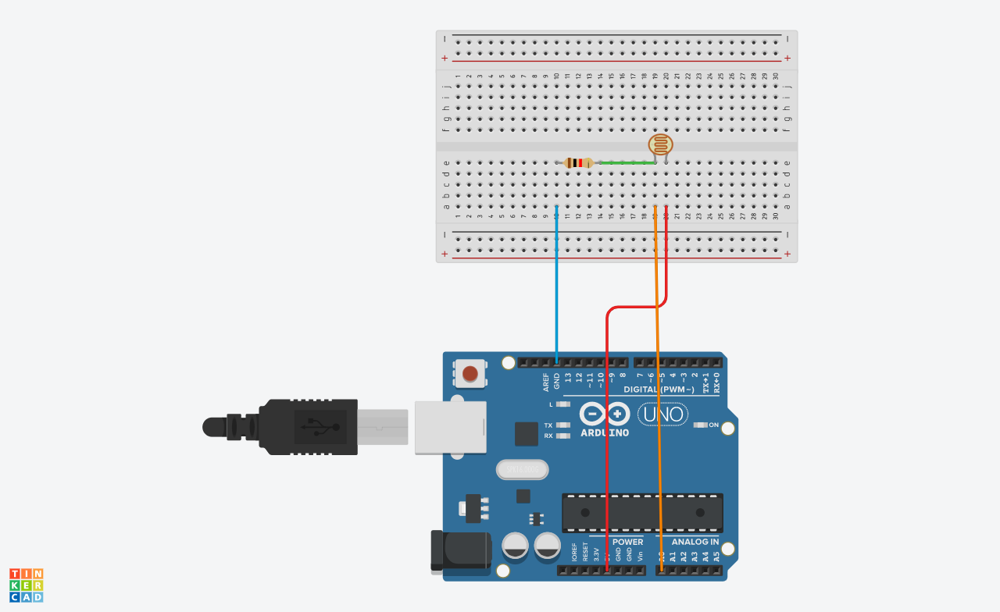
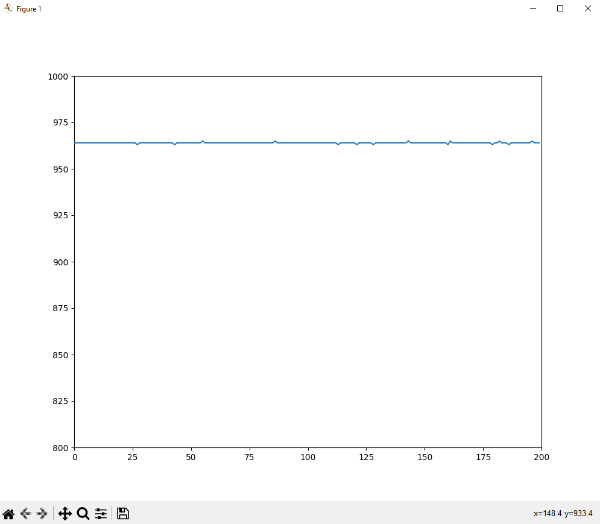
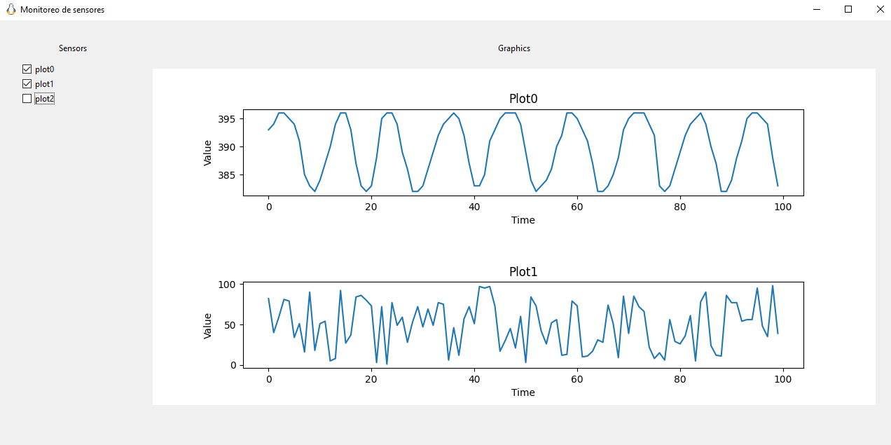
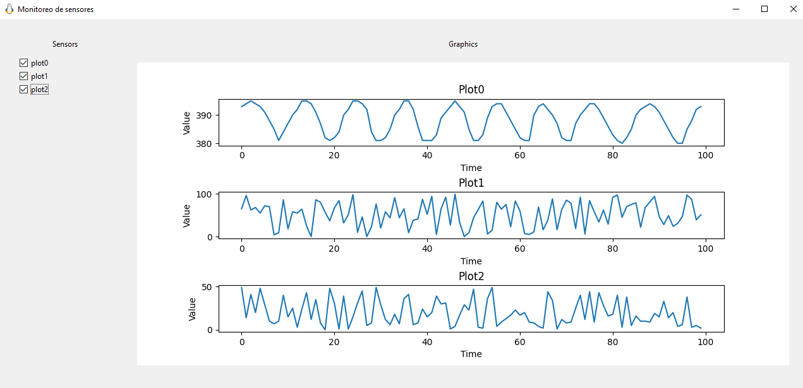

# Graphic

In this project we seek to be able to graph data in real time, as a first step we will seek to graph the data received from a sensor and as a final step we will graph data from multiple sensors. For the graphical interface part, we rely on libraries such as tkinter and matplotlib.

As an extra step, we want to add checkbuttons to mark which graphs we want to visualize in the graphical interface.

## Prerequisites

To run this program it is necessary to have **python3**, to check the version with the following command:
```bash
python --version
```
It will also be necessary to have the python package manager system better known as **pip**, check that you have it installed with the following command that gives us the version of pip in the case of having it installed:
```bash
pip -V
```
With pip you will need to install:
**pyserial**:
```bash
pip install pyserial
```
**matplotlib**:
```bash
pip install matplotlib
```
And **tkinter**:
```bash
pip install tk
```
Finally, an Arduino UNO will be needed, with the following circuit:

And some of the following programs loaded in the arduino UNO depending on the main file that you want to execute, in this case the arduino uno file to load in the circuit will correspond to the name of the main file that you want to execute.
[mainGraph.ino](src/arduino/mainGraph.ino)
[mainMultiGraphs.ino](src/arduino/mainMultiGraphs.ino)
Finally, it should be noted that the circuit was not changed because, in the program inserted in the arduino, we send randomly generated test data to the program that is in charge of graphing..

## Program execution

To execute the program we need to open the terminal and locate ourselves in the folder where the main program we want to run is located, suppose that file is called: **main.py**, once inside said directory, we will execute the following command:
```bash
python main.py
```
another alternative could be:
```bash
python3 main.py
```

## Results of program execution

### Result with mainGraph.py program



### Result with mainMultiGraphs.py program


